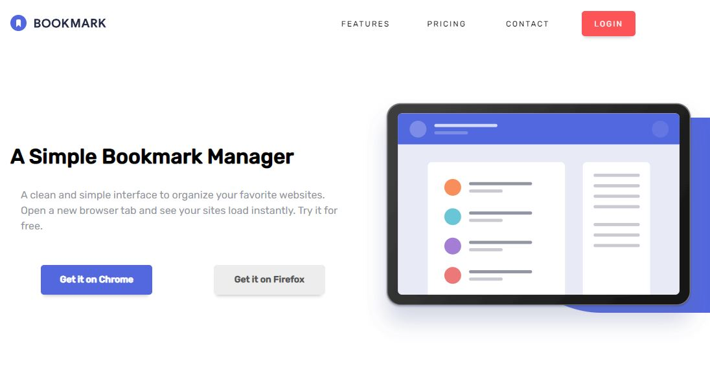

# Frontend Mentor - Bookmark landing page solution

This is a solution to the [Bookmark landing page challenge on Frontend Mentor](https://www.frontendmentor.io/challenges/bookmark-landing-page-5d0b588a9edda32581d29158). Frontend Mentor challenges help you improve your coding skills by building realistic projects. 

## Table of contents

- [Overview](#overview)
  - [The challenge](#the-challenge)
  - [Screenshot](#screenshot)
  - [Links](#links)
- [My process](#my-process)
  - [Built with](#built-with)
  - [What I learned](#what-i-learned)
  - [Continued development](#continued-development)
  - [Useful resources](#useful-resources)
- [Author](#author)

## Overview

### The challenge

Users should be able to:

- View the optimal layout for the site depending on their device's screen size
- See hover states for all interactive elements on the page
- Receive an error message when the newsletter form is submitted if:
  - The input field is empty
  - The email address is not formatted correctly

### Screenshot

### Links

- Solution URL: [Github Repo](https://github.com/CMikeZeltner/FEMentor-bookmark-landing-page)
- Live Site URL: [Vercel](https://fem-entor-bookmark-landing-page.vercel.app/)

## My process

### Built with

- SASS

### What I learned

For this project I decided to learn how to use SASS. I'm glad I did, as it made my styling easier and more maintainable. Looking back at my SASS markup, I can feel I came a long way since I started this project. Overall, the styling is a little messy, I missed the chance to make some components that would have reduced my file size, but I'm still glad with how things turned out. Not bad for a first try.

### Continued development

I would like my next project to be full-stack, whether I complete another FrontEndMentor challenge or make something up on my own. I'd like to use SASS again for the project, and maybe jQuery as well. I'm excited to continue learning and I know my next project will be even better than the ones that came before.

### Useful resources

- https://sass-lang.com/guide - Basic overview of what SASS has to offer, the whole website, really.
- https://itnext.io/structuring-your-sass-projects-c8d41fa55ed4 - This website shows two different ways to structure your SASS files.

## Author

- Frontend Mentor - [@CMikeZeltner](https://www.frontendmentor.io/profile/CMikeZeltner)
